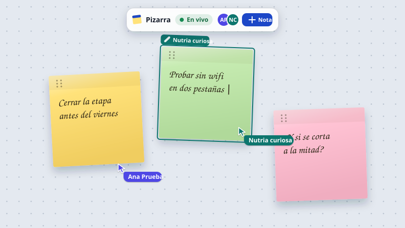
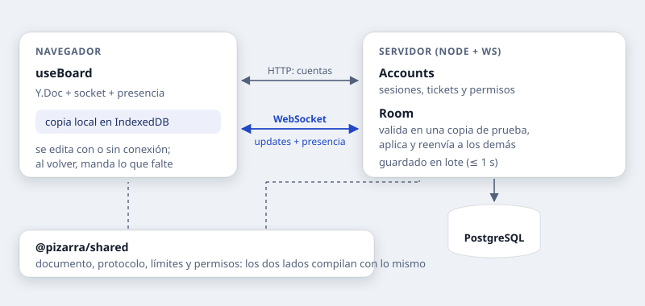

# Pizarra · caso de estudio

Una pizarra colaborativa en tiempo real, construida en siete etapas para tener a mano un
proyecto donde se vean las decisiones: cómo se sincroniza, qué pasa cuando dos personas
tocan lo mismo, qué pasa sin conexión, quién puede entrar y qué se rompe cuando algo
falla de verdad.

Este documento cuenta el porqué. El [README](README.md) es la referencia técnica (cómo
correrlo, arquitectura, protocolo, esquema, despliegue), y la app tiene una versión
corta de esta historia en `/caso`.



---

## En una frase

Varias personas abren el mismo enlace y crean, mueven y escriben notas adhesivas a la
vez, viendo los cursores de las demás; se puede seguir editando sin conexión y todo
queda guardado.

| | |
| --- | --- |
| **Cliente** | React 19 + Vite, local-first (IndexedDB), router propio |
| **Servidor** | Node.js + `ws` sobre `http`, sin framework |
| **Datos** | Un documento Yjs (CRDT) por sala, guardado en PostgreSQL con `pg` y SQL a mano |
| **Tamaño** | ~8.800 líneas de fuente y ~3.100 de pruebas, en 3 paquetes de un monorepo |
| **Pruebas** | 146 (110 del servidor con clientes WebSocket reales, 36 del cliente) |
| **Dependencias de producción** | 10: `yjs`, `lib0`, `ws`, `pg`, `tsx`, `react`, `react-dom`, `y-indexeddb` y dos de fuentes |

---

## Por qué esta idea

Quería un proyecto que no se resolviera con un CRUD. Una pizarra compartida obliga a
responder preguntas incómodas desde el primer día:

- **Tiempo real de verdad:** veinte mensajes por segundo mientras alguien arrastra una
  nota, y la pantalla de las demás personas tiene que ir con eso sin parpadear.
- **Conflictos:** dos personas escriben en la misma nota al mismo tiempo. ¿Gana una?
  ¿Se fusiona? ¿Qué ve cada una mientras tanto?
- **Sin conexión:** si el wifi se corta a mitad de una idea, ¿se pierde?
- **Identidad y permisos:** el enlace es lo que hace útil la pizarra, pero no siempre
  quieres que cualquiera con el enlace escriba.
- **Operación:** hay que guardarlo, desplegarlo y que sobreviva a reiniciar el servidor.

Y una razón más: son problemas donde la respuesta fácil funciona en la demo y falla en
cuanto hay dos personas y una conexión mala.

---

## Las reglas que me puse

1. **Sin framework de servidor, sin ORM y sin librería de validación.** `ws`, `pg` y SQL
   escrito a mano. No porque los frameworks estén mal, sino porque en un proyecto que se
   mira para entender cómo funciona algo, la capa que lo esconde le quita la gracia.
2. **TypeScript estricto en los tres paquetes, con el protocolo compartido.** Los
   mensajes viven en `shared/`: cambiar uno rompe la compilación del cliente y del
   servidor a la vez. El servidor tiene un validador por tipo de mensaje (un tipo mapeado
   obliga a que exista) y el cliente un `switch` exhaustivo con `never`.
3. **El servidor no confía en el cliente.** Nunca. Ni en la forma de los mensajes, ni en
   el contenido de un update, ni en el nombre que dice tener quien se conecta.
4. **Cada etapa termina usable.** Nada de ramas largas: la Etapa 1 ya era una pizarra que
   funcionaba, y cada etapa siguiente la mejoró sin romperla.
5. **Todo en español**, menos los identificadores del código.

---

## Cómo funciona



**El documento de una sala es un `Y.Doc`**: un mapa de notas, y cada nota es otro mapa
con `x`, `y`, `color`, `rotation`, `z` y un `Y.Text` para el texto. Posición y color se
resuelven con la última escritura, que es lo que la gente espera al mover una nota; el
texto se fusiona carácter a carácter, que es lo que la gente espera al escribir.

**La memoria es la fuente de verdad** mientras la sala está abierta. Un arrastre genera
veinte escrituras por segundo: guardarlas todas sería desperdiciar la base. Cada cambio
marca la sala y, como mucho un segundo después, se guarda el estado completo del
documento. Un arrastre entero termina siendo una o dos escrituras, y hay una prueba que
lo comprueba.

---

## Seis decisiones y lo que costaron

### 1. Protocolo propio en vez de `y-websocket`

Cuando migré a CRDTs (Etapa 4) ya existían las salas, la presencia, la validación y la
persistencia. Lo que faltaba era el modelo de datos, no el transporte. Los updates de
Yjs viajan en base64 dentro del mismo JSON que el resto de los mensajes.

**El precio:** un 33 % más de tamaño por el base64. **Lo que gané:** un solo camino de
entrada, que pasa por la misma validación y las mismas pruebas que todo lo demás.

### 2. Validar en una copia de prueba y rechazar, en vez de corregir

Un update de CRDT no se puede deshacer: si se aplica y después se mira, un cliente
malicioso puede dejar el documento inválido para todo el mundo. Cada `doc:update` se
aplica primero a una **copia de prueba** de la sala; si el documento resultante no cumple
el esquema y los límites, se descarta la copia, se responde con un error y se cierra la
conexión con un código que le dice al cliente que descarte su copia local y se
resincronice.

**El precio:** validar el documento entero en cada update, y una reconexión para el
cliente rechazado. **Lo que gané:** el documento aceptado nunca pasa por un estado
inválido. Un cliente honesto no llega ahí nunca, porque respeta los mismos límites.

### 3. Local-first: se acabó el modo de solo lectura

Hasta la Etapa 3, sin conexión el tablero se bloqueaba. Con Yjs pude darle la vuelta: el
documento vive en IndexedDB, se edita con o sin conexión, y la conexión se abre recién
cuando la copia local terminó de cargar, para que el primer intercambio ya incluya lo que
se editó en visitas anteriores.

**El precio:** los límites del servidor tuvieron que ser más holgados que los de la
interfaz, porque al fusionar lo que varias personas editaron por separado se puede
superar lo que cada una respetó. **Lo que gané:** el corte de wifi dejó de ser un error.

### 4. Deshacer por persona sale del propio CRDT

`Y.UndoManager` sigue solo las transacciones de esta pestaña, así que deshacer nunca
revierte lo que hizo otra persona. No hizo falta historial compartido ni coordinación.

**El precio:** una opción incómoda (`ignoreRemoteMapChanges`) que hay que entender para
elegir bien; ver «Lo que se rompió».

### 5. Las cuentas son opcionales

El enlace es lo que hace útil una pizarra: obligar a registrarse para mirar un tablero
habría roto eso. Una cuenta agrega propiedad (el tablero es de quien escribe primero en
él), permisos y la lista de tus tableros.

**El precio:** dos caminos que mantener (con cuenta y sin ella) y un modelo de permisos
que tiene que resolver bien el caso «sin dueño». **Lo que gané:** compartir sigue siendo
pegar un enlace.

### 6. El WebSocket se abre con un ticket, no con el token

El navegador no deja poner cabeceras al abrir un WebSocket, así que la identidad tiene
que ir en la URL. Una URL de conexión puede terminar en registros y proxys, y ahí no
puede ir algo que sirva por treinta días: el cliente pide un **ticket de un solo uso**
que vive treinta segundos.

**El precio:** una petición HTTP antes de cada conexión. **Lo que gané:** el token de
sesión no sale nunca de la cabecera `Authorization`.

---

## Lo que se rompió

Ninguno de estos lo habría encontrado el compilador. Casi todos aparecieron probando a
mano, con dos pestañas y el servidor a medio morir.

### El socket zombi

Maté el servidor a propósito para ver la reconexión. Una pestaña reconectó; la otra se
quedó mostrando **«En vivo»** sin recibir nada. El servidor ya detectaba clientes muertos
con el ping/pong del protocolo, pero ese ping lo responde el navegador solo y **desde
JavaScript no se ve**: para el cliente, un socket abierto y mudo es indistinguible de uno
sano en silencio.

La solución fue simétrica: el servidor manda además un mensaje `heartbeat` cada 30 s y el
cliente reconecta si pasa 75 s sin recibir nada. Lo verifiqué bajando el tiempo a 3 s:
antes el socket quedaba abierto indefinidamente; después se cierra y reconecta solo.

### Deshacer que borraba una nota

Probando `Ctrl+Z` entre dos pestañas: movía una nota, la otra pestaña la movía después, y
al deshacer **desaparecía la nota entera**. Yjs, cuando un paso ya no se puede aplicar
(porque otra persona pisó ese campo), lo descarta en silencio y deshace el paso anterior
—que era la creación de la nota—.

Lo resolví cambiando cómo se comporta deshacer sobre los campos que ya se resuelven con
la última escritura: devolver una nota a su sitio es, en este documento, un movimiento
más. El texto no entra en ese trato: al ser un CRDT de secuencia, deshacer quita solo los
caracteres propios.

### El arrastre que se partía en dos pasos

Un arrastre escribe una posición cada 50 ms; Yjs agrupa los cambios que llegan seguidos.
Pero si te quedás quieto un segundo antes de soltar, la posición final cae fuera de la
ventana de agrupación y queda en su propio paso: `Ctrl+Z` dejaba la nota a medio camino.
Ahora, mientras dura el gesto, la ventana se mantiene abierta. Se ve en una prueba que
simula el arrastre con una pausa de 1,2 s.

### El cursor que saltaba al final

Deshacer desde el botón de la barra devolvía el texto pero mandaba el cursor al final.
El orden era el culpable: enfocar el textarea dispara `onFocus`, que recuerda como
posición del cursor el final del texto, **antes** de que la restauración pudiera leer la
posición buena. Ahora se resuelve el cursor primero y se enfoca después.

### El tablero que seguía sin dueño

En la Etapa 6, tras escribir la primera nota el panel seguía diciendo «este tablero
todavía no tiene dueño»: la propiedad se anotaba al guardar en lote, hasta un segundo
después, y nadie se lo contaba al cliente. Ahora el servidor guarda el tablero en ese
momento y avisa con un mensaje `access`; la interfaz responde con un «Este tablero ya es
tuyo».

### El error que no era JSON

Este lo encontró **la primera prueba del cliente que escribí**: una respuesta de error
que no fuera JSON —el HTML de un proxy caído, por ejemplo— reventaba con un `SyntaxError`
en lugar de mostrar un aviso.

---

## Cómo lo probé

**146 pruebas**, y algo más de trabajo del que parece a simple vista:

- **Las del servidor levantan el servidor real** en un puerto libre y conectan clientes
  WebSocket de verdad, cada uno con su propio documento Yjs que sincroniza igual que el
  cliente real (incluido desconectarse, editar y volver).
- **Contra dos bases de datos:** por defecto PGlite (PostgreSQL compilado a WASM, sin
  instalar nada) y, con una variable de entorno, contra un PostgreSQL real en un esquema
  temporal propio. Las mismas pruebas, los dos caminos.
- **Pruebas de mutación a mano:** rompí a propósito el código para comprobar que las
  pruebas lo notaban. Quitar la opción de deshacer rompe su prueba; tratar lo que llega
  del servidor como propio rompe tres; espaciar las escrituras de un arrastre convierte
  «2 escrituras» en 20.
- **Las del cliente** (Vitest y jsdom) prueban lo que se ve y se puede hacer: entrar,
  errores del servidor, botones apagados, la sesión guardada.
- **A mano, en el navegador**, con dos pestañas y PostgreSQL real: fusión de texto con el
  cursor en medio, edición sin conexión con recarga, deshacer y rehacer, permisos que
  cambian en vivo, y matar el servidor para ver qué pasa.

---

## Lo que dejé fuera, a propósito

- **Un solo proceso de servidor.** Cada sala vive en la memoria de una instancia; con
  varias, dos personas en la misma sala podrían caer en procesos distintos. Escalar
  pediría enrutar por sala o un bus compartido, y eso no agrega nada a lo que el proyecto
  quiere mostrar.
- **Sin compactación del documento.** El historial de Yjs crece despacio (las ediciones
  dejan marcas de borrado); con los límites actuales no es un problema.
- **Sin verificación de correo ni recuperación de contraseña:** hacen falta correos
  salientes.
- **Invitaciones por correo, no por enlace.** Es cómodo, pero permite averiguar si un
  correo está registrado; con más tráfico convendría lo contrario.
- **Sin cursores en pantallas táctiles** (no hay puntero que mostrar) y sin nombres de
  tablero.

---

## Qué haría distinto

- **Validar solo lo que el update tocó**, en vez del documento entero. Con estos límites
  da igual, pero es lo primero que se notaría si un tablero creciera mucho.
- **Empezar por los CRDTs.** La Etapa 1 resolvió los conflictos con «la última escritura
  gana» y la Etapa 4 lo reemplazó entero. Se aprendió mucho en el camino, pero si supiera
  lo que sé ahora, el documento sería Yjs desde el primer día.
- **Pruebas del cliente desde antes.** Llegaron en la Etapa 6 y encontraron un error en
  la primera. No hacía falta esperar tanto.

---

## Las siete etapas

| | Etapa | Lo que trajo |
| --- | --- | --- |
| 1 | MVP en tiempo real | Tablero, notas, WebSocket, validación a mano, reconexión |
| 2 | Salas y persistencia | Una URL por tablero, PostgreSQL, guardado en lote |
| 3 | Presencia | Cursores en vivo con nombre y color, quién edita qué |
| 4 | Conflictos y robustez | CRDTs con Yjs, edición sin conexión, señal de vida |
| 5 | Deshacer y rehacer | Por persona, agrupado por gesto, con el cursor de vuelta |
| 6 | Cuentas y permisos | Cuentas opcionales, visibilidad, invitaciones, límites, pruebas del cliente |
| 7 | Caso de estudio | Este documento y la página `/caso` de la app |

---

## Probarlo

```bash
npm install
docker compose up -d   # PostgreSQL local (opcional: sin esto, todo vive en memoria)
npm run dev            # servidor en :8080 y cliente en :5173
```

Crea un tablero y abre su enlace en otra pestaña o en otro navegador. Para ver lo
interesante: escriban los dos en la misma nota a la vez, corten la conexión del servidor
y sigan escribiendo, y vuelvan a levantarlo.

El detalle de cada decisión, el protocolo, el esquema de la base y las instrucciones de
despliegue están en el [README](README.md).
